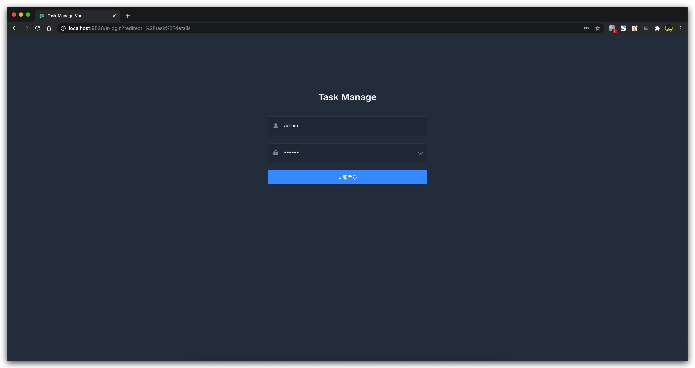
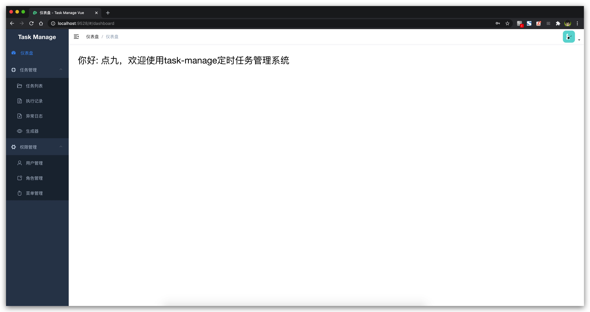
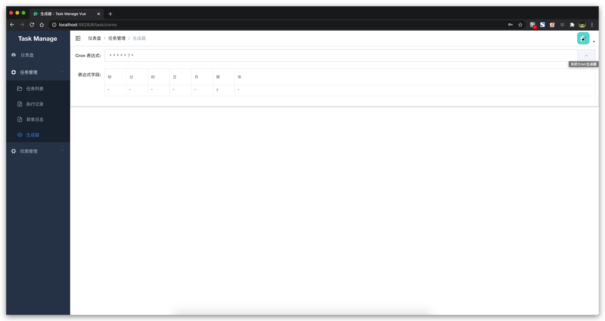
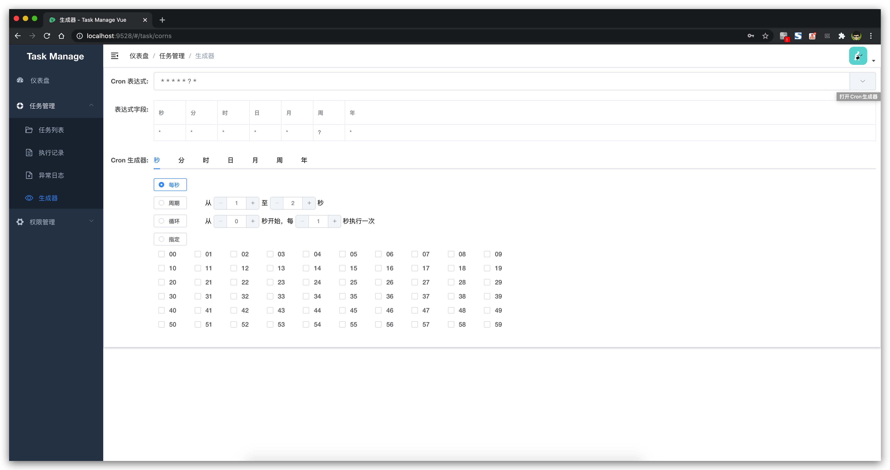
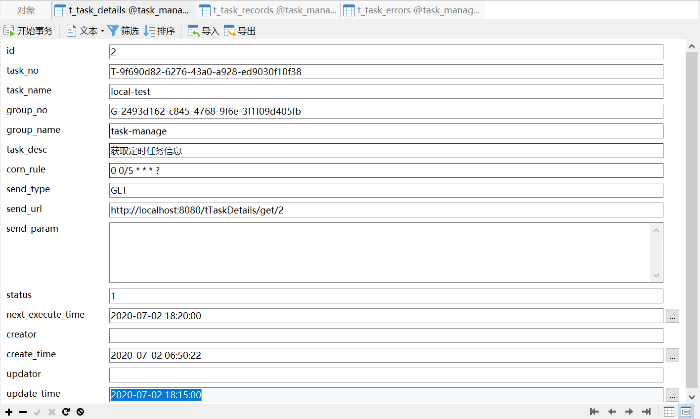
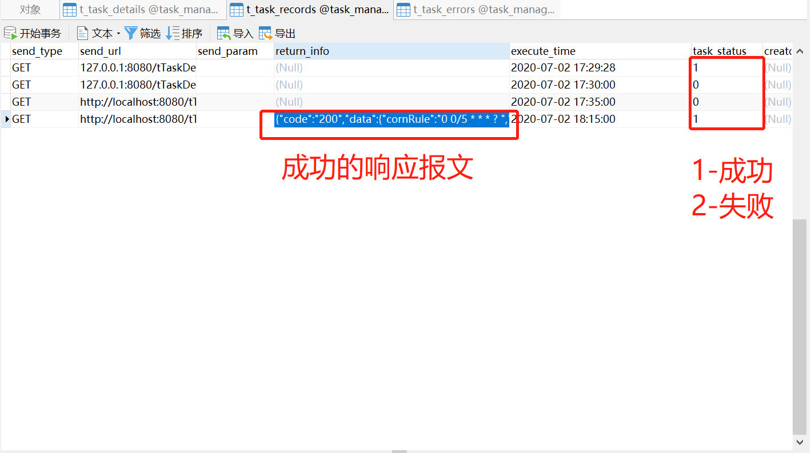
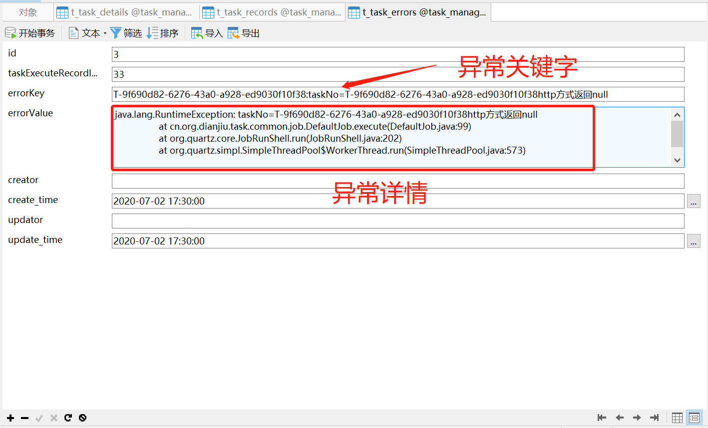

# Task Manage
 
> 基于SpringBoto的定时轻量级定时任务管理系统

[https://github.com/dianjiu/task-manage](https://github.com/dianjiu/task-manage)

[https://gitee.io/dianjiu/task-manage](https://gitee.io/dianjiu/task-manage)

## 相关项目 task-manage-vue

> A vue admin template with Element UI for task-manage

https://github.com/dianjiu/task-manage-vue

https://gitee.io/dianjiu/task-manage-vue

## 技术选型
- springboot 2.3.1
- SpringSecurity 2.3.1
- httpclient 4.5.12
- quartz 2.3.2
- druid 1.1.22
- fastjson 1.2.71

## 项目功能
1. springboot集成security、quartz、httpclient ，使用druid连接池 
2. 同时支持swagger2、knife4j接口API调试
3. 支持用户登录、登出、新增、权限管理的基础功能
4. 支持http请求任务定时调度，当前支持get、postFrom(formdata表单)、postJson(JSON数据)三种请求类型，并记录返回内容
5. 支持调用接口(/tTask/add)进行http任务添加 
6. 通过web界面根据jobname或jobgroup进行查询
7. 通过web界面进行jobgroup的新增、删除的管理操作
8. 通过web界面进行任务管理，包括任务启用、停用、立即运行、新增、修改、删除等功能
9. 通过web页面查看任务执行历史、下次执行时间，执行错误日志

## 开发进度

- [x] 实现任务记录的新增、修改、删除、查询功能
- [x] 实现任务记录的启用、暂停、立即启动功能
- [x] 实现任务记录根据任务名称和分组名称唯一查询
- [x] 实现执行历史的新增、修改、删除、查询功能
- [x] 实现任务日志的新增、修改、删除、查询功能
- [ ] 实现用户的新增、登录、登出、RBAC功能

## 部署方式
1. 执行sql目录下的task_manage.sql文件，建立task_manage需要的数据库表  
2. 修改application-local.yml中的数据库连接方式
3. 访问 http://localhost:8080/idnex.html 可通过web界面进行定时任务的管理

## 在线演示

http://task.point9.top/damin   (部署中。。。)

测试账号  	测试密码

admin 		admin

user 		user

## 项目图片

### 页面演示
> 登录页

> 仪表盘

> 任务管理 =》生成器 （关闭cron生成器）

> 任务管理 =》生成器 （打开cron生成器）

### 数据库演示

> 任务信息表

> 执行记录表

> 异常信息表

## 最后致谢
感谢以下开源项目提供的项目参考
- https://github.com/helloflygit/springboot-quartz
- https://gitee.com/52itstyle/spring-boot-task
- https://github.com/simonsfan/springboot-quartz-demo

